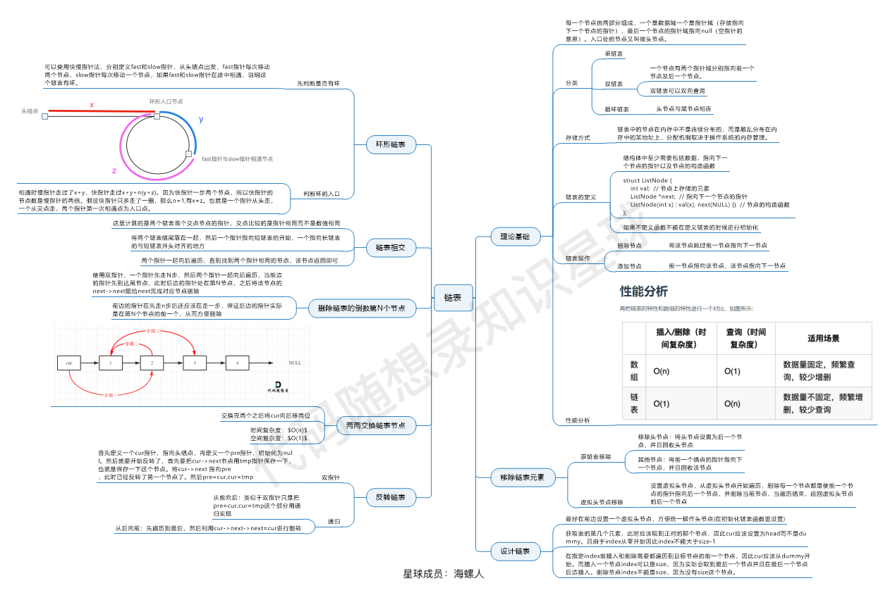

# 链表
## 链表的基本操作
+ 获取链表第index个节点的数值
  
+ 在链表的最前面插入一个节点
  
+ 在链表的最后面插入一个节点
  
+ 在链表第index个节点前面插入一个节点
  
+ 删除链表的第index个节点的数值
## 反转链表
+ 迭代
```c++
ListNode* reverseList(ListNode* head) {
        ListNode* temp; // 保存cur的下一个节点
        ListNode* cur = head;
        ListNode* pre = NULL;
        while(cur) {
            temp = cur->next;  // 保存一下 cur的下一个节点，因为接下来要改变cur->next
            cur->next = pre; // 翻转操作
            // 更新pre 和 cur指针
            pre = cur;
            cur = temp;
        }
        return pre;
    }
```
+ 递归
```c++
ListNode* reverse(ListNode* pre,ListNode* cur){
        if(cur == NULL) return pre;
        ListNode* temp = cur->next;
        cur->next = pre;
        // 可以和双指针法的代码进行对比，如下递归的写法，其实就是做了这两步
        // pre = cur;
        // cur = temp;
        return reverse(cur,temp);
    }
    ListNode* reverseList(ListNode* head) {
        // 和双指针法初始化是一样的逻辑
        // ListNode* cur = head;
        // ListNode* pre = NULL;
        return reverse(NULL, head);
    }

```
## 删除倒数第n个节点
+ 先反转，再删除，再反转（*暴力至极*）
+ 利用双指针进行操作，通过快慢指针，确认倒数第n个链表
## 链表相交
+ 利用哈希表，先遍历其中一个链表，将其储存在哈希表中，
再遍历另外一个链表，确认是否存在相同节点在哈希表中
+ 利用双指针，确认两条链表的长度，一个先走，一个后走
## 环形链表
+ 利用快慢指针，若二者相遇则存在环，此时出发一个指针，从头出发
与慢指针相遇的时候，就是环的入口

## 小技巧
在对链表进行增删操作的时候，头部经常是特例，为了方便处理
可以使用虚拟头，方便了头部的处理且不影响head

## 总结
