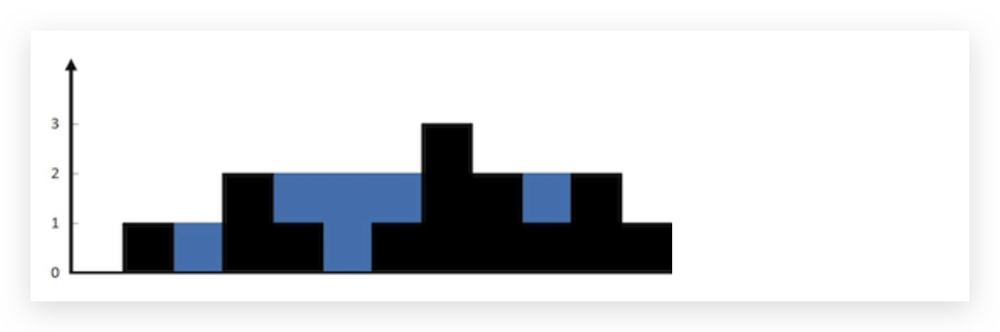
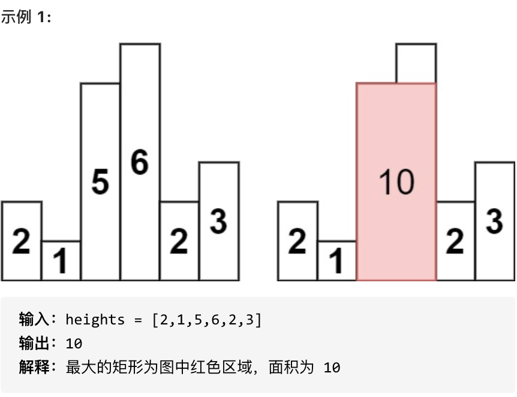

# 单调栈
## 接雨水
**题目**

给定 n 个非负整数表示每个宽度为 1 的柱子的高度图，

计算按此排列的柱子，下雨之后能接多少雨水。



**思考**

对于一道实际应用题，首先我们应该理清这类题目如何转为数学表达

在理清题目大意后，我们需要关注数据类型（如果小数字可以考虑暴力解法————不到万不得已不要使用）

之后我们应该选取合适的数据结构及算法来解决题目（题目也有可能有提示）

比如说这道题目可以使用单调栈解决（目前很难看出），截然确定了数据结构
我们要理清我们的任务是什么，以及拟定一个合适的计算方式（围绕结构与算法）

这道题目大量的时间像无头苍蝇一样，乱摸索，我们既然知道他是单调栈
我们应该思考单调栈可以做些什么，然后根据单调栈的功能，思考如何将题目
中的雨水面积和单调栈（下一个更值）联系起来。

**代码**

```c++
stack<int> st;
    st.push(0);
    int ans = 0;
    for (int i = 1; i < height.size(); i++) {
        while (!st.empty() && height[st.top()] < height[i]) {
            int index = st.top();
            st.pop();//现推出栈顶，与栈内上一个元素做比较（关键）
            if (!st.empty()) {
                ans += (min(height[i], height[st.top()]) - height[index]) * (i - st.top() - 1);
            }
        }
        st.push(i);
    }
    return ans;
```

## 最大矩形面积
**题目**

给定 n 个非负整数，用来表示柱状图中各个柱子的高度。每个柱子彼此相邻，且宽度为 1 。

求在该柱状图中，能够勾勒出来的矩形的最大面积。



**思考**

和上题一样，既然知道了是用单调栈解决问题，单调栈的特性为找到下一个更值

那么我们就要将矩形面积与更值解决起来

**自己的解法**

```c++
stack<pair<int,int>> st;//第二位表示如果栈空。加入的下一个元素要加上之前栈的长度
    int ans = 0;
    int Area = 0;//计算矩形面积
    int num = 0;//记录因为他被推出的数
    st.emplace(0,0);
    for(int i=1;i<heights.size();i++) {
        num = 0;
        while(!st.empty() && heights[st.top().first] > heights[i]) {
            Area = heights[st.top().first] * (i + st.top().second - st.top().first);
            if(Area > ans) {
                ans = Area;
            }
            num += st.top().second + 1;
            st.pop();
        }
        st.emplace(i,num);
    }
    while(!st.empty()) {//如果到底没有遇到更小的值
        Area = heights[st.top().first] * (heights.size() + st.top().second - st.top().first);
        if(Area > ans) {
            ans = Area;
        }
        st.pop();
    }
    return ans;
```
上述为我自己的解法，属于是不断补缺口一点一点慢慢补出来的

有一个思路，类比接雨水，但是对接雨水的先退栈再利用栈内两个元素的关系计算
和链表的虚拟头没有更好的理解

**代码随想录升级版**

```c++
stack<int> st;
        heights.insert(heights.begin(), 0); // 数组头部加入元素0
        heights.push_back(0); // 数组尾部加入元素0
        st.push(0);
        int result = 0;
        for (int i = 1; i < heights.size(); i++) {
            while (heights[i] < heights[st.top()]) {
                int mid = st.top();
                st.pop();
                int w = i - st.top() - 1;
                int h = heights[mid];
                result = max(result, w * h);
            }
            st.push(i);
        }
        return result;
```
