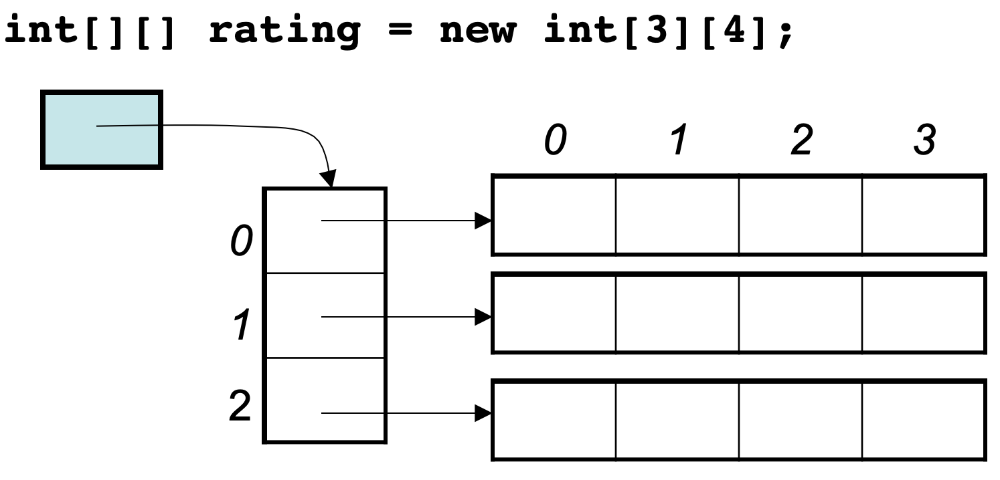
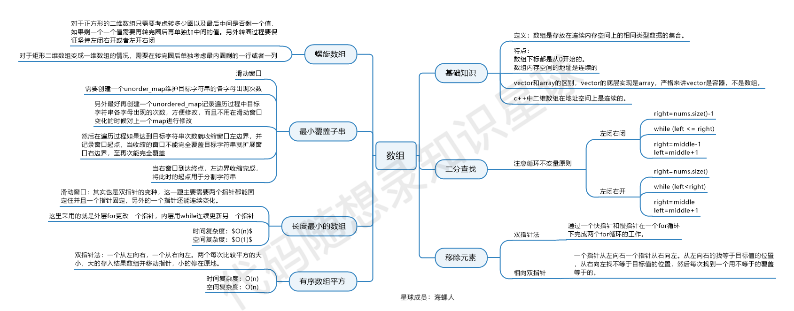

# 数组
数组是存放在连续的内存空间上的相同类型的集合

**注**：
+ c、c++上的二维数组是连续的内存空间长度为n*m
+ java上的二维数组并不连续

数组的元素是不能删的，只能覆盖，这是因为：
+ 数组在内存中是连续的地址空间，不能释放单一元素，如果要释放，就是全释放（程序运行结束，回收内存栈空间）。 
+ C++中vector和array的区别一定要弄清楚，vector的底层实现是array，封装后使用更友好

# 数组经典的题目
## 二分查找
时间复杂度：O（log n）

写法有两种

1.左闭右闭
```c++
right = nums.size() - 1;
while(left <= right){
right = middle - 1;
left = middle + 1;
}
return low;//第一个大于或等于的位置
```
2.左闭右开
```c++
right = nums.size();
while(left < right){
right = middle;
left = middle + 1;
}
return low;//第一个大于或等于的位置
```
## 双指针法
时间复杂度：O（n）；

利用双指针的思想进行遍历，根据题目条件，动态的更新左右两个指针
以更快的速度进行删除等操作
## 滑动窗口
其实也是一种双指针，构建出一个窗口进行滑动，在某些情况下可以更快的遍历数组

滑动窗口的题目主要要理解滑动窗口如何移动 窗口起始位置，达到动态更新窗口大小的，从而得出长度最小的符合条件的长度。

滑动窗口的精妙之处在于根据当前子序列和大小的情况，不断调节子序列的起始位置。从而将O(n^2)的暴力解法降为O(n)。
## 前缀和
构建前缀和数组可以更快的得到区间和
# 总结
