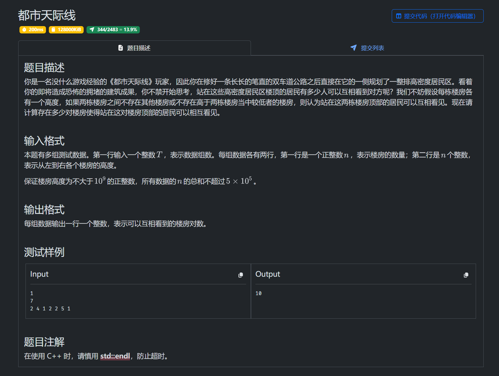

# 第一次作业 —— 数据结构
作业难度适宜，基本靠自己可以解决

主要考察几个数据结构，栈（stack）、队列（queue）、双端队列（deque）、
链表（List）、数组（array）————看到这想想相关功能，记不太清回去看看

算了，估计懒得找，自己看看都是另外一件事

整理如下（感谢deepseek友情支持）

---

### 🎯 数据结构战队：超能力大盘点

| 数据结构 | 江湖绰号 | 核心超能力 (特点) | 必杀技 (操作) | 日常任务 (应用场景) | 它的“弱点” |
| :--- | :--- | :--- | :--- | :--- | :--- |
| **栈 (Stack)** | **“后悔药”大师** | **后进先出 (LIFO)** - 最后一个进来的，第一个出去！ | `push` (压入)、`pop` (弹出) <br> (只在头顶一个口操作) | 函数调用、撤销操作、浏览器后退 | 中间的兄弟它管不着 |
| **队列 (Queue)** | **“公平侠”** | **先进先出 (FIFO)** - 讲究先来后到，绝对公平！ | `enqueue` (入队)、`dequeue` (出队) <br> (尾进头出，像隧道) | 消息队列、打印排队、BFS算法 | 想插队？没门！ |
| **双端队列 (Deque)** | **“双头龙”** | **两端皆可** - 能进能出，能屈能伸，超级灵活！ | `addFront`、`removeFront` <br> `addRear`、`removeRear` | 滑动窗口、工作窃取算法 | 有点“墙头草”两边倒 |
| **链表 (List)** | **“灵巧手”** | **手拉手，好朋友** - 靠指针连接，内存不用挤一起。 | `insert`、`delete` (超快) <br> `get` (按顺序找，有点慢) | 高频增删的场景、内存管理 | 找第n个元素？等我一路问过去... |
| **数组 (Array)** | **“闪电侠”** | **连续空间大房东** - 所有房客(元素)住一起，门牌号(索引)清晰。 | `get`、`set` (超光速) <br> `insert`、`delete` (可能要搬家，慢) | 快速随机访问、构建哈希表 | 大小固定，搬家(扩容)很麻烦 |

---

### 🎨 看图识英雄：它们长什么样？

#### 1. 栈 (Stack) - 羽毛球筒英雄
```
      |---|
      | C |  <- 栈顶 (Top) - 唯一能操作的地方
      |---|
      | B |
      |---|
      | A |
      |---|
```
**口诀**：后进先出，像筒装球，压入弹出，顶上一口。

#### 2. 队列 (Queue) - 单行道隧道英雄
```
出队 (dequeue) <-- [ A | B | C | D ] <-- 入队 (enqueue)
      (队首 Front)                 (队尾 Rear)
```
**口诀**：先进先出，像隧道排队，尾进头出，公平万岁。

#### 3. 双端队列 (Deque) - 两头通的贪吃蛇
```
<-- 出/入 -->   [ A | B | C | D ]   <-- 出/入 -->
  (Front头)                     (Rear尾)
```
**口诀**：双端队列，两头都通，能当栈用，能当队列。

#### 4. 链表 (List) - 手拉手小火车
```
[数据 | next] -> [数据 | next] -> [数据 | next] -> NULL
  ↑ Head (头节点)
```
**口诀**：链式存储，指针引路，插入删除，快如闪电。

#### 5. 数组 (Array) - 整齐的宿舍楼
```
索引:  0    1    2    3    4
     [ A | B | C | D | E ]
```
**口诀**：连续内存，索引寻址，随机访问，天下第一。

---

### 🎭 它们的“职场”小剧场

*   **数组** 和 **链表** 在吵架：
    *   **数组**：`“我查东西快得像闪电！你给我个下标，我立马告诉你是谁！”`
    *   **链表**：`“呸！你一大家子挤在一块，想插个队或者删个人，全体都要搬家，慢死啦！看我，随便插，随便删，只需改变一下指针的‘心意’，轻松加愉快！”`

*   **栈** 在帮我们写文档：
    *   你每敲一个字符，它就帮你 `push` 一个动作记录。
    *   当你猛按 `Ctrl+Z` (撤销) 时，它就不慌不忙地把最近的动作 `pop` 出来扔掉。
    *   `“嘻嘻，最近犯的错，得最先改掉！”`

*   **队列** 在火锅店门口：
    *   `“王先生您好，您是小桌18号，前边还有5桌，这是您的排队单~”`
    *   它永远保证先来的客人先吃上，绝对的公平主义者！

*   **双端队列** 在秀操作：
    *   `“听说栈和队列都很牛？它们俩的技能我全都会！我左边能进右边能出，右边能进左边也能出，我是最强的！”`


# 题目总结
主要是对数据结构的利用，思考什么结构放到相应情景下数独最快

防止超时，还要有输入输出的优化
```c++
ios::sync_with_stdio(false);
cin.tie(nullptr);
cout<<"\n"//不使用cout<<endl，其刷新缓冲区，使得速度变慢
```
其中最后一题单独拿出做一个题解
# 都市天际线 ————单调栈

题目如下



 看到题目，先行思考对某一个楼，能看到他的楼有什么特点，那就是

二者之间没有比这栋楼本身更高的楼且不比另外一个楼高

这貌似有着单调栈的特点

故我们保证栈内元素单调递减，找下一个比栈顶大的元素

如果栈未空，栈内元素可以组成一对，推出去的和刚进入的也可以是一对

同时如果两栋楼高度相同，我们将其并在一起，当一栋楼处理
代码如下

```c++
long long city(vector<long long> arr) {
    int n = arr.size();
    long long ans = 0;
    stack<pair<int,int>> st;
    st.push({arr[0],1});
    for (int i = 1; i < n;i++){
        int cnt = 1;//记录相同楼层数
        while (!st.empty()&&st.top().first < arr[i]){
            ans += st.top().second;//与arr[i]组成一对新的
            st.pop();
        }
        if (!st.empty()&&st.top().first == arr[i]){
            ans += st.top().second;//二者本身就可以组成新的
            cnt += st.top().second;
            st.pop();
        }
        if (!st.empty()){
            ans++;//栈顶的和即将推入的也可以组成一对
        }
        st.push({arr[i],cnt});
    }
    return ans;
}
```
需要注意的是，这里容易遗忘相同高度的处理