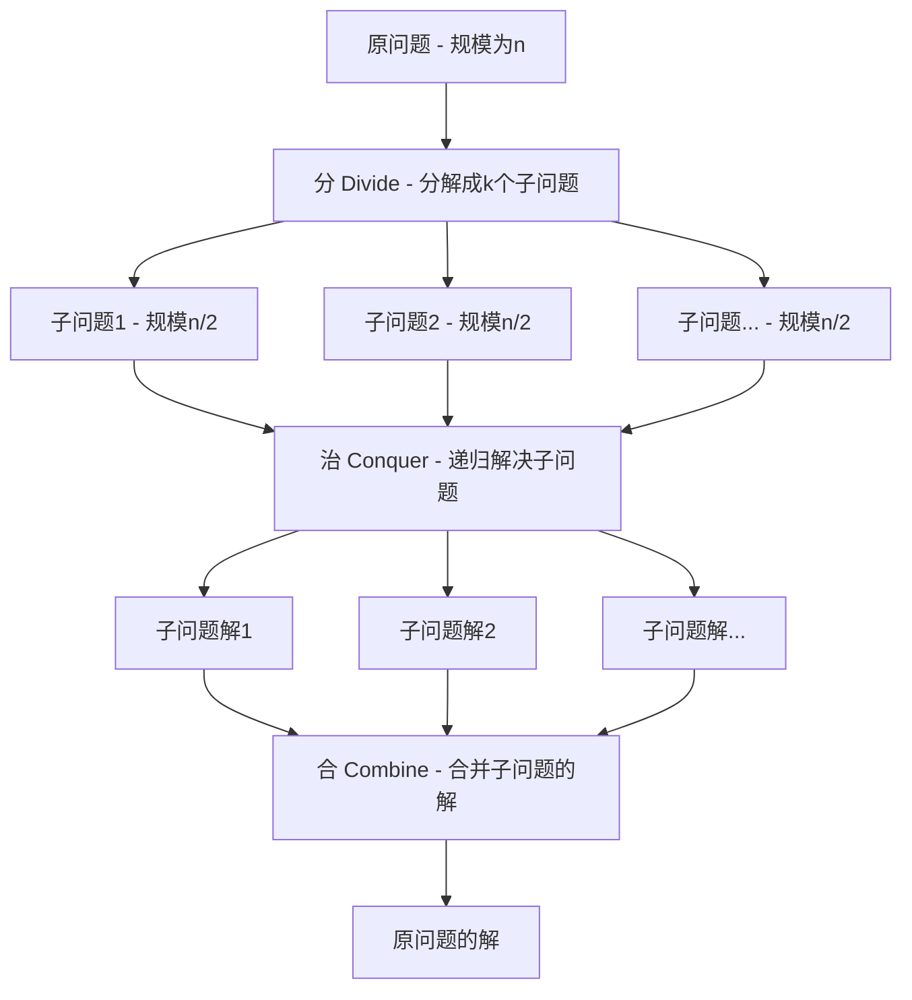

# 第二次作业 —— 分治策略

作业难度很大，要去世了。。。。。。。。。。。。。

考试等死了😭😭😭😭😭😭

感觉每题都需要单独写一份题解（分治策略还是太难了）

先写一下什么叫分治策略吧（deepseek登场）

写在deepseek前 ———— 将问题分成小份，小份解决后再合并成大份，以递归
迭代等手段实现（貌似递归为主），常见有归并排序、二分查找、峰值查找等

好的！我们来用一种清晰、活泼的方式总结一下算法中的“武林绝学”——**分治策略**。

---

### 🧠 分治策略：化繁为简的“神仙算法”

想象一下，你有一大块巧克力（一个复杂的大问题），你每次都对半掰开（分解），直到得到最小的一块（最简单的小问题），然后轻松吃掉它（解决），最后把吃掉的每一块汇总一下，就相当于解决了整个大问题（合并）！

这就是分治策略的精髓：**“分而治之”**。

---

### 🎯 分治策略的核心三步曲

分治算法就像一位经验丰富的大将军，对付任何强敌（复杂问题）都只用了三招：

1.  **分 (Divide)** - **“分散敌人，逐个击破”**
    *   将一个大而复杂的问题**分解**成若干个规模更小、但**性质相同**的子问题。
    *   *就像把一个大项目拆成几个小任务分给不同的组。*

2.  **治 (Conquer)** - **“解决小兵，易如反掌”**
    *   **递归地**解决这些子问题。如果子问题还足够大，就继续调用这三招（递归）；如果子问题已经足够小，简单到可以直接解决，那就直接搞定它。
    *   *就像每个小组去完成自己的小任务，如果任务还能细分，就再分下去，直到每个人都知道具体该做什么。*

3.  **合 (Combine)** - **“集合战果，大获全胜”**
    *   将各个子问题的解**合并**起来，最终得到原问题的解。
    *   *就像各个小组完成任务后，项目经理把大家的成果整合起来，完成整个大项目。*

---

### 📊 一图流看懂分治策略

---

### 🌟 分治算法的“明星学员”

*   **归并排序 (Merge Sort)**：
    *   **分**：把乱序数组对半分成两个子数组。
    *   **治**：递归地对两个子数组进行排序。
    *   **合**：将两个已排序的子数组合并成一个大的有序数组。

*   **快速排序 (Quick Sort)**：
    *   **分**：选一个“基准”，把数组分成“比基准小”和“比基准大”的两半。
    *   **治**：递归地对左右两半进行排序。
    *   **合**？：不需要显式的合并步骤，因为排序是在分解过程中进行的。

*   **二分查找 (Binary Search)**：
    *   **分**：每次都和中间元素比较，将搜索范围缩小一半。
    *   **治**：在缩小后的范围内继续查找。
    *   **合**：不需要合并，找到就返回结果。

*   **汉诺塔问题**：经典的递归启蒙问题，完美体现了分治思想。

---

### ✅ 分治策略的“技能评估”

| 优点 👍 | 缺点 👎 |
| :--- | :--- |
| **简化问题**：将复杂问题转化为一系列简单问题。 | **递归开销**：递归调用会消耗额外的栈空间，可能导致栈溢出。 |
| **易于并行**：子问题通常相互独立，可以同时解决（并行计算）。 | **子问题重叠**：如果子问题不是独立的（存在大量重复计算），效率会很低（此时动态规划更优）。 |
| **算法高效**：通常能带来**对数级**或**线性级**的性能提升，远超暴力算法。 | **并不万能**：不是所有问题都能“分”，前提是问题可以分解且子问题的解可以合并。 |

---

### 🧐 何时请出“分治”这位大神？

满足以下**三个条件**，就可以考虑使用分治策略：

1.  **可分解性**：该问题可以分解成若干个规模更小的**相同子问题**。
2.  ️**独立性**：这些子问题相互**独立**，一个子的解不会影响另一个。
3.  **可合并性**：解决并合并这些子问题的解，可以产生原问题的解。

### 一句话总结

> **分治策略就是一种“大事化小，小事化了”的递归艺术。它先把问题拆到不能再拆，然后从最简单的情况开始解决，最后层层汇总，一举拿下大BOSS！**

题解就放弃了吧，考试直接等死，现在不想写 !